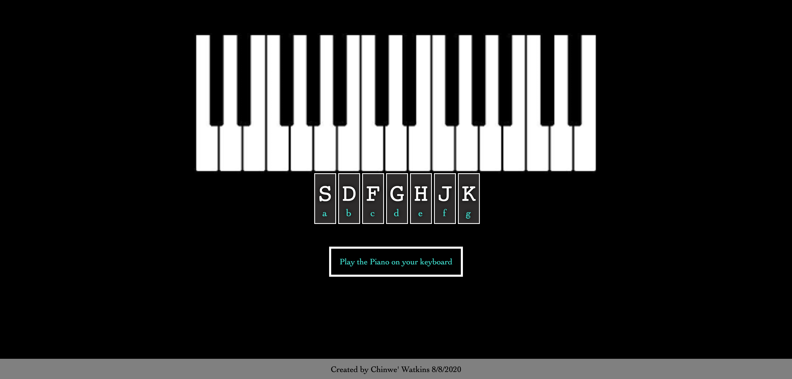

# js-challenge-remake

Day 1 of the 30 JS Code Challenge focused on:
- key events
- playing audio
- listening for the transitionend event

I thought it would be fun to take what I learned and create a similar but diffent app. So I created a small piano, with a few notes that can be played using the home row on your keyboard.

Enjoy!

